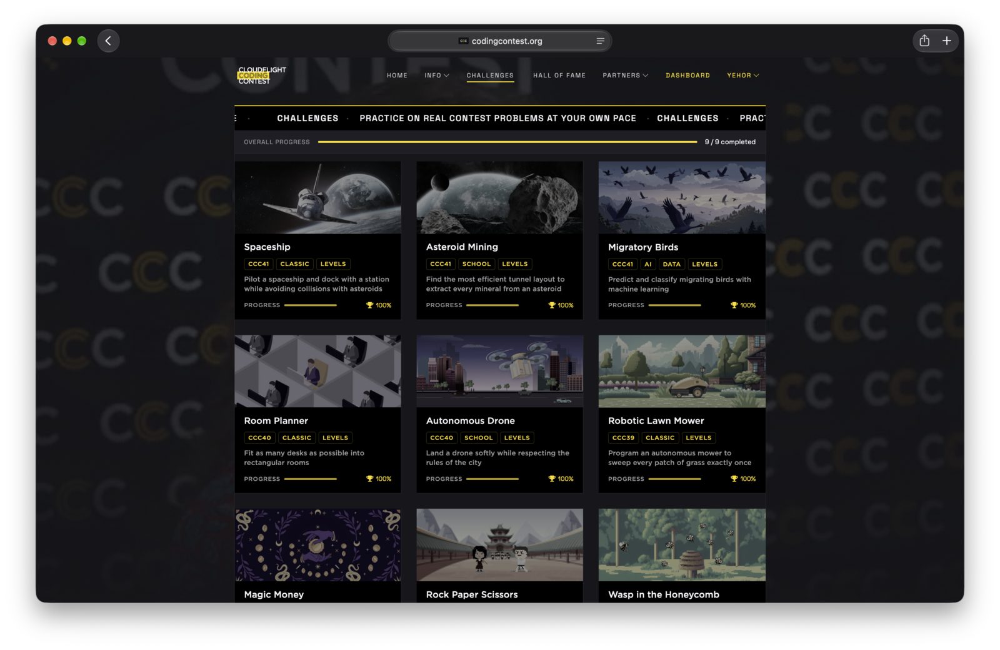

# CodingContest MCP

Multi-account Streamable HTTP MCP server for [codingcontest.org](https://codingcontest.org), covering challenges, competitions, files, submissions, and results.



## Quick start

```sh
cp .env.example .env
docker compose up --build -d
```

Or with Python 3.12+: `pip install -r requirements.txt && python server.py`.

## Connect and use

Connect to `http://localhost:8000/mcp` with `X-CCC-Session: <CCC SESSION cookie>` (omit `SESSION=`). Public deployments require HTTPS and `MCP_PUBLIC_ORIGIN`.
